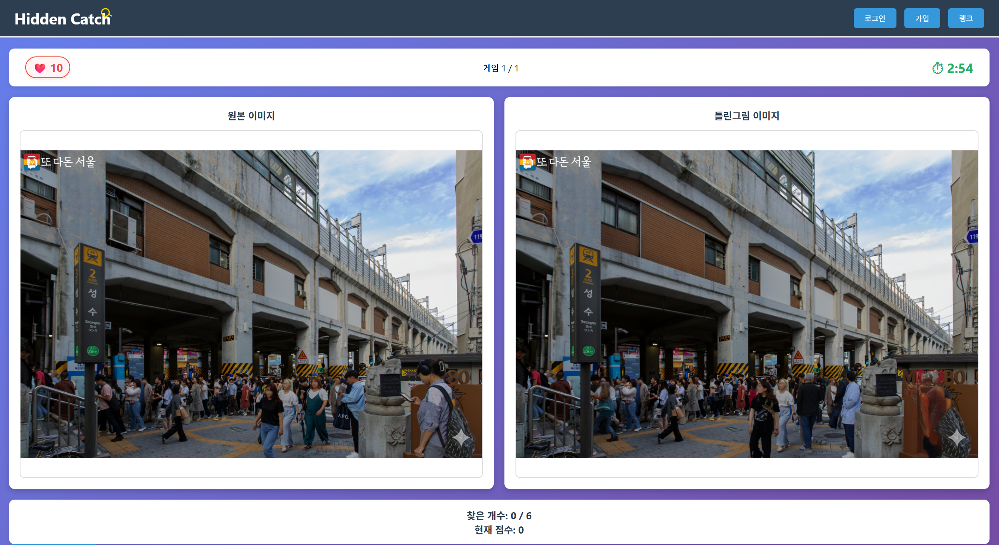

# Hidden Catch - AI 기반 틀린그림찾기 게임


> AI가 자동으로 틀린그림을 생성하는 인터랙티브 웹 게임

## 📖 프로젝트 소개

Hidden Catch는 사용자가 업로드한 이미지를 **Google Cloud Vision**으로 분석하고 **Gemini 이미지 모델**로 수정하여 틀린그림찾기 퍼즐을 생성하는 웹 기반 게임입니다.

> **2026-09 파이프라인 v2**: 편집 모델 종료(`imagen-3.0-capability-001`, 2026-06-30)에 대응해 Gemini 3.1 이미지 모델 + 자체 마스크 합성으로 이전하고, 생성 지연·전송량을 크게 줄였습니다. 분석과 근거는 [docs/ai-pipeline-optimization-research.md](docs/ai-pipeline-optimization-research.md), 동작·설정은 [docs/puzzle-pipeline-v2.md](docs/puzzle-pipeline-v2.md)를 보세요.

## 📺 프로젝트 시연 영상 (클릭하여 재생)
[](https://youtu.be/YM23d_cMYHg)

🎮 라이브 데모 접속: http://3.35.22.142/

### 주요 특징

- 🎨 **AI 자동 퍼즐 생성**: Cloud Vision으로 객체 탐지, Gemini 이미지 모델로 편집 후 마스크 합성·픽셀 차이 검증으로 "실제로 바뀐 영역"만 정답으로 저장
- ⚡ **빠른 제공**: 브라우저 축소·병렬 업로드, 1024px 정규화, 슬롯당 단일 태스크, 같은 사진 재업로드 시 S3 캐시로 즉시 제공
- 🎮 **인터랙티브 게임플레이**: 3분 타이머, 목숨 시스템, 실시간 정답 확인
- 🏗️ **현대적 아키텍처**: FastAPI, React, Celery 비동기 처리
- ☁️ **AWS 클라우드 배포**: EC2, RDS, S3를 활용한 확장 가능한 인프라
- 🐳 **Docker 기반**: 간편한 로컬 개발 및 배포 환경

## 🎯 게임 플로우

1. **이미지 업로드**: 사용자가 최대 3장의 이미지를 업로드
2. **AI 처리** (이미지마다 병렬, 첫 퍼즐이 준비되면 바로 시작):
   - 이미지를 1024px로 정규화하고 Vision API가 주요 객체 탐지
   - Gemini 이미지 모델이 탐지 영역을 수정 → 마스크 합성으로 영역 밖은 원본 그대로 유지
   - 영역별 픽셀 차이를 측정해 실제로 바뀐 곳만 정답으로 저장
3. **게임 시작**: 원본과 수정된 이미지를 비교하며 다른 부분 찾기
4. **점수 계산**: 정답 개수, 플레이 시간에 따라 점수 부여

## 🛠️ 기술 스택

### Frontend
- **React 18**: 컴포넌트 기반 UI
- **CSS3**: 반응형 디자인 및 애니메이션

### Backend
- **FastAPI**: 고성능 비동기 API 서버
- **SQLAlchemy 2.0**: ORM 및 데이터베이스 관리
- **Celery 5.5**: 비동기 작업 처리 (AI 이미지 처리)
- **Redis 7**: 메시지 브로커 및 캐싱

### AI & Cloud
- **Google Cloud Vision**: 객체 탐지 (object localization)
- **Google Gemini 3.1 Flash-Lite Image** (폴백: Flash Image): 이미지 편집, Vertex AI global 엔드포인트
- **AWS S3**: 이미지 스토리지
- **AWS RDS**: PostgreSQL 데이터베이스
- **AWS EC2**: 애플리케이션 호스팅

### DevOps
- **Docker & Docker Compose**: 컨테이너화
- **Nginx**: 리버스 프록시 및 정적 파일 서빙
- **uv**: Python 패키지 관리

## 📁 프로젝트 구조

```
term-project/
├── docs/                       # 문서
│   ├── ai-pipeline-optimization-research.md  # 파이프라인 분석·최적화 연구
│   ├── puzzle-pipeline-v2.md   # v2 아키텍처·설정·운영
│   ├── sequence-diagrams.md    # 시퀀스 다이어그램
│   └── architecture.svg / userflow.png
├── src/
│   ├── front/
│   │   └── game-app/          # React 프론트엔드
│   │       ├── src/
│   │       │   ├── components/ # React 컴포넌트
│   │       │   └── App.js
│   │       └── package.json
│   ├── backend/               # FastAPI 백엔드
│   │   ├── app/
│   │   │   ├── api/           # API 엔드포인트
│   │   │   ├── models/        # SQLAlchemy 모델
│   │   │   ├── services/      # 비즈니스 로직
│   │   │   ├── worker/        # Celery 태스크 (tasks, imaging, geometry, detect)
│   │   │   └── core/          # 설정 및 유틸리티
│   │   ├── tests/             # 오프라인 테스트 (가짜 S3/Vision/Gemini + SQLite)
│   │   └── pyproject.toml
│   ├── infra/
│   │   └── nginx/             # Nginx 설정
│   └── docker-compose.yml     # Docker 오케스트레이션
└── README.md
```

## 🚀 시작하기

### 사전 요구사항

- Docker & Docker Compose
- Node.js 18+ (로컬 개발 시)
- Python 3.13+ (로컬 개발 시)

### 로컬 개발 환경 설정

1. **저장소 클론**
```bash
git clone https://github.com/hidden-catch/hidden-catch1.git
cd hidden-catch1
```

2. **환경 변수 설정**
```bash
cd src
cp .env.example .env
# .env 파일을 편집하여 필요한 키 입력:
# - DATABASE_URL
# - AWS_S3_BUCKET_NAME, AWS_ACCESS_KEY_ID, AWS_SECRET_ACCESS_KEY
# - GOOGLE_APPLICATION_CREDENTIALS (GCP 서비스 계정 키 경로)
# - GCP_PROJECT_ID
# 선택: GCP_LOCATION(global), IMAGE_EDIT_MODEL, PUZZLE_MAX_EDGE, PUZZLE_CACHE_ENABLED,
#       CELERY_CONCURRENCY — 전체 목록은 docs/puzzle-pipeline-v2.md §3
```

3. **Docker Compose 실행**
```bash
docker compose up -d
```

### 프론트엔드 개발 서버 (선택사항)

```bash
cd src/front/game-app
npm install
npm start  # http://localhost:3000
```

### 백엔드 개발 서버 (선택사항)

```bash
cd src/backend
uv sync
source .venv/bin/activate  # Windows: .venv\Scripts\activate
uvicorn app.main:app --reload
pytest -q                  # 외부 API 없이 파이프라인/상태 전이 테스트
```

## 🎮 사용 방법

1. **홈페이지 접속**: 브라우저에서 http://3.35.22.142 열기
2. **이미지 업로드**: "게임 시작" 버튼 클릭 후 1~3장의 이미지 선택
3. **AI 처리 대기**: 퍼즐 생성 중 진행률 표시 (첫 퍼즐 준비까지 보통 수십 초, 나머지는 플레이 중 생성)
4. **게임 플레이**: 
   - 원본과 수정된 이미지를 비교
   - 다른 부분을 클릭하여 정답 찾기
   - 3분 제한 시간, 10개의 목숨
5. **점수 확인**: 모든 스테이지 완료 후 최종 점수 확인

## 🏗️ 아키텍처

```
User Browser
    ↓
  Nginx (Port 80)
    ↓
FastAPI Backend (Port 8000) ←→ PostgreSQL (RDS)
    ↓                          ↓
  Redis (Port 6379)         S3 Bucket
    ↓
Celery Worker → Vision API / Gemini Image Model (Vertex AI)
```

자세한 시퀀스 다이어그램은 [docs/sequence-diagrams.md](docs/sequence-diagrams.md)를 참조하세요.

## 📊 주요 기능

### 1. AI 이미지 처리 파이프라인 (v2)
- 업로드본을 1024px로 정규화(EXIF 보정, 모델 지원 비율로 크롭) 후 Vision API로 객체 탐지
- 포함관계·겹침·크기 규칙으로 최대 5개 영역 선택, feather 마스크 생성
- Gemini 이미지 모델에 원본 + 번호 박스 힌트 + 편집 지시를 보내 수정본 생성 (모델 폴백 지원)
- 수정본을 마스크로 원본에 합성 → 영역별 픽셀 차이를 측정해 실제로 바뀐 영역만 정답 저장
- 원본/수정본 JPEG와 매니페스트를 S3 `puzzle-cache/v1/<sha256>/`에 저장 (재업로드 시 재사용)

### 2. 게임 메커니즘
- 클릭 좌표 기반 정답 판정 (오차 범위 50px)
- `object-fit: contain` 보정으로 정확한 좌표 매핑
- 실시간 점수 계산 및 진행 상태 추적
- 다중 스테이지 지원

### 3. 비동기 작업 처리
- 슬롯당 Celery 태스크 1개 (`generate_puzzle_for_slot`), 브로커에는 slot id만 전달
- 워커 동시성 기본 3 (`CELERY_CONCURRENCY`), acks_late로 워커 장애 시 재전달
- 프론트엔드가 1.5초 간격으로 `ready_stages/failed_stages`를 받아 진행률 표시, 실패 즉시 안내

## 🐛 트러블슈팅

### Vision API 가 탐지한 객체가 포함관계인 경우
- 포함관계에 있는 객체들은(ex: 자전거 안에 바퀴) Imagen API가 동시에 수정하기 어려움.
- 유저 입장에서 큰 객체 보다는 작은 객체를 찾는 것이 더 흥미로움.
- Vision API가 탐지한 객체 중 포함관계에 있는 객체들은 트리구조에 담아서
  리프 노드에 작은 객체가 모이게 처리 및 분리하여 Imagen API에 요청.

### 이미지 로딩 실패
- S3 버킷 정책 확인 (CORS 설정)
- Presigned URL 만료 시간 확인 (기본 15분)

### 퍼즐 생성이 실패한다 (`analysis_error`에 ImageEditError)
- Vertex AI에서 `gemini-3.1-flash-lite-image` / `gemini-3.1-flash-image` 사용 권한과 `GCP_LOCATION=global` 확인
- 모델 종료 공지가 있으면 `IMAGE_EDIT_MODEL` 환경 변수만 바꿔 재기동 (코드 수정 불필요)
- 워커 로그 `puzzle ready … timings=` / `puzzle generation failed`로 단계별 원인 확인

## 📝 API 문서

주요 엔드포인트:
- `POST /api/v1/games` - 게임 생성
- `POST /api/v1/games/{game_id}/uploads/complete` - 업로드 완료
- `POST /api/v1/games/{game_id}/uploads/failed` - 업로드 실패 슬롯 건너뛰기
- `GET /api/v1/games/{game_id}` - 게임 상태 조회 (`ready_stages`, `failed_stages` 포함)
- `POST /api/v1/games/{game_id}/stages/{stage}/check` - 정답 확인
- `POST /api/v1/games/{game_id}/stages/{stage}/complete` - 스테이지 완료


## 📄 라이선스

This project is licensed under the MIT License.

## 👥 개발팀

- **Frontend & Infrastructure**: [정찬수]
- **Backend**: [양승조]
- **AI Integration**: [양승조/정찬수]
- **UI/UX Design**: [윤석현]

## 🔗 관련 링크

- [파이프라인 최적화 연구](docs/ai-pipeline-optimization-research.md)
- [파이프라인 v2 아키텍처·설정](docs/puzzle-pipeline-v2.md)
- [시퀀스 다이어그램](docs/sequence-diagrams.md)
- [GitHub Repository](https://github.com/hidden-catch/hidden-catch1)

## 📮 문의

프로젝트에 대한 질문이나 제안사항이 있으시면 이슈를 등록해주세요!
