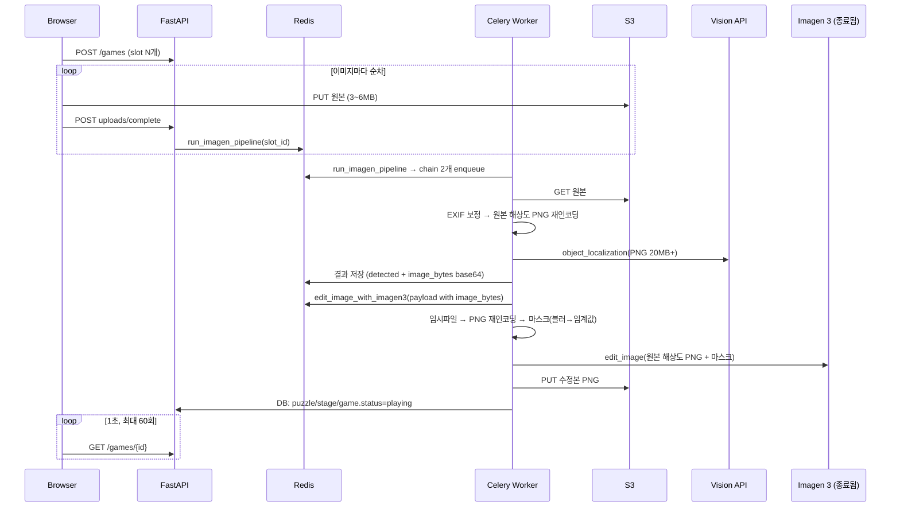
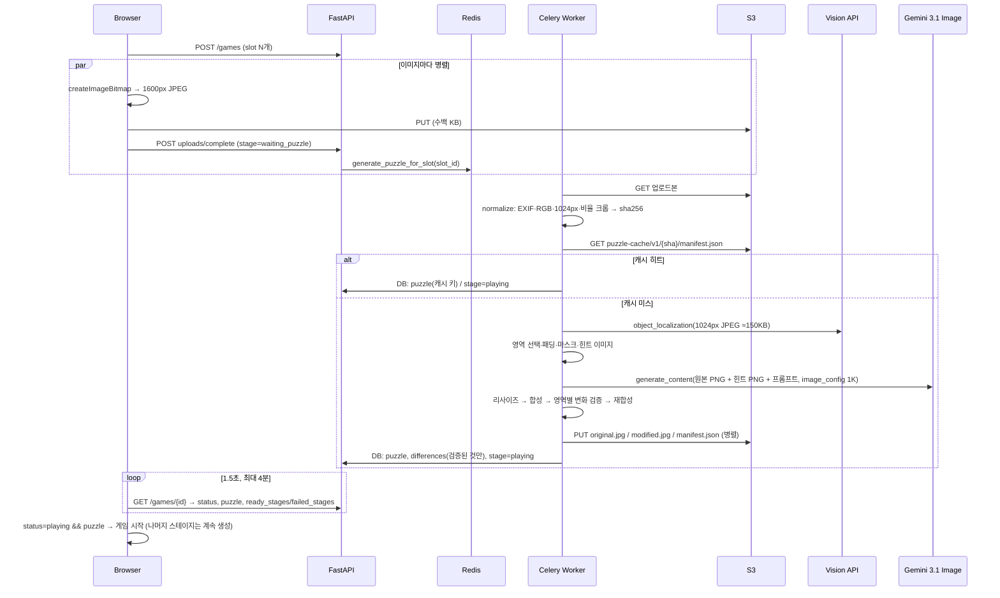

# AI 틀린그림 생성 파이프라인 최적화 연구

> 작성일: 2026-09-16 · 대상 코드: `src/backend/app/worker/*`, `src/backend/app/services/game_service.py`, `src/front/game-app/src/components/*`
> 목표: **사용자가 사진을 올린 뒤 첫 퍼즐을 보기까지 걸리는 시간**과 **이미지 1장당 처리 비용**을 줄이고, 생성 실패를 사용자에게 즉시 드러내는 것.

---

## 0. 요약 (TL;DR)

| # | 발견 | 영향 | 조치 |
|---|------|------|------|
| 1 | 편집 모델 `imagen-3.0-capability-001`이 **2026-06-30에 종료**됨 ([모델 카드](https://docs.cloud.google.com/vertex-ai/generative-ai/docs/models/imagen/3-0-capability-001)) | 현재 파이프라인은 편집 단계에서 100% 실패 | Gemini 3.1 이미지 모델로 이전 + **자체 마스크 합성** 전략 (v2) |
| 2 | 정규화된 원본 PNG(수십 MB)를 **Redis를 통해** 다음 태스크로 전달 (base64) | 태스크 간 수 초 지연, Redis 메모리 폭증 | 슬롯 1개 = 태스크 1개로 통합, 브로커에는 slot id만 |
| 3 | 원본 해상도(12MP급) 그대로 PNG 재인코딩 3회 + Vision/Imagen에 20MB급 업로드 | 단계당 수 초, Vision 정확도 이득 없음(권장 640×480) | 다운로드 직후 **1024px로 1회 정규화**, 이후 전 단계가 소형 이미지 사용 |
| 4 | 브라우저가 원본(3~6MB)을 **순차** 업로드 | 모바일에서 장당 수 초 × N | 브라우저에서 1600px JPEG로 축소 후 **병렬** 업로드 |
| 5 | 편집이 실제로 일어났는지 검증 없음 → 못 찾는 "정답" 발생 | 게임 품질 저하 | 영역별 픽셀 차이 측정, 바뀌지 않은 영역은 원본으로 복원·정답에서 제외 |
| 6 | 폴링 상한 60초 vs 실제 생성 30~60초+, 스테이지 순서 레이스, 실패 시 무한 대기 | 타임아웃 알림, 빈 퍼즐 화면 | 4분 상한 + 진행률 표시, "가장 낮은 미완료 스테이지" 규칙, 실패 상태 도입 |
| 7 | 같은 사진을 다시 올려도 매번 AI 호출 | 비용·지연 반복 | 픽셀 SHA-256 기반 **S3 콘텐츠 주소 캐시** |
| 8 | `main` 브랜치에서 백엔드 파일 15개 유실 (`ce58724` 정리 커밋이 merge에 섞임) | 저장소 상태로는 빌드 불가 | `75bc4f5`에서 복원 |

기대 효과(추정, §4.3): 첫 퍼즐까지의 체감 대기 **약 60~120초 → 15~30초**, 이미지 1장당 네트워크 전송량 **수십 MB → 약 2~3MB**, 재업로드 시 AI 비용 **0**.

---

## 1. 조사 범위와 방법

1. **코드 정독**: 업로드 → Celery 체인(`detect_objects_for_slot` → `edit_image_with_imagen3`) → 상태 폴링 → 게임 플레이까지 요청 경로 전체.
2. **git 히스토리 분석**: `git log --graph`, 파일별 마지막 존재 커밋 추적 (§2.4).
3. **외부 문서 확인**: Vertex AI 모델 카드/가격/리전, Gemini 이미지 생성 문서, Cloud Vision 권장 해상도·가격 (§8).
4. **SDK 인트로스펙션**: 설치된 `google-genai 2.23.0`에서 `GenerateContentConfig.image_config`, `ImageConfig.image_size` 등 실제 필드 확인. `kombu` JSON 직렬화가 `bytes`를 `{"__type__": "base64", ...}`로 감싸는 것도 실행으로 확인.
5. **재현 테스트**: 외부 API 없이 가짜 S3/Vision/Gemini와 SQLite로 파이프라인·상태 전이를 검증하는 테스트 34개 작성 (`src/backend/tests/`).

지연 시간 수치는 실측이 아닌 **코드 구조에서 유도한 추정**이며, v2에는 단계별 시간을 로그로 남기는 계측을 넣어 실측할 수 있게 했다 (§5.3).

---

## 2. 기존(v1) 파이프라인 분석

### 2.1 흐름



### 2.2 단계별 병목

| 단계 | v1 동작 | 문제 | 근거 |
|------|---------|------|------|
| 브라우저 업로드 | 원본 파일을 슬롯 순서대로 `await` 하며 순차 PUT | 12MP 사진 3장 ≈ 12~18MB, 모바일 업로드 수십 초. 1장 실패 시 `return`으로 전체 중단 | `ImageUploadPage.js` 업로드 루프 |
| 업로드 완료 처리 | `head_object`로 Content-Type 검증 후 `run_imagen_pipeline.delay` | 문제 없음 (S3 왕복 1회) | `game_service.mark_upload_complete` |
| 태스크 구조 | `run_imagen_pipeline` → `chain(detect, edit)` | 태스크 3개 홉, 결과 백엔드 기록 2회 | `tasks.py` v1 |
| 이미지 정규화 | `exif_transpose` 후 **원본 해상도 PNG** 저장 | 12MP → 20~30MB PNG, 인코딩 수 초 | `detect_objects_for_slot` |
| 객체 탐지 | 위 PNG를 Vision에 전송 | Vision은 640×480 이상에서 정확도 이득이 거의 없고 처리량만 감소 ([문서](https://docs.cloud.google.com/vision/docs/supported-files)); 20MB 초과 시 오류 | Vision 문서 |
| 태스크 간 전달 | `return {"image_bytes": normalized_image_bytes}` | JSON 직렬화 → base64(+33%) → Redis 결과 백엔드 + 다음 태스크 메시지, 총 2회 | kombu 동작 확인 |
| 편집 준비 | 임시 파일 기록 → PIL 재오픈 → **또 PNG 재인코딩**, 마스크에 GaussianBlur 후 100 임계값 | 블러 후 임계값은 결과적으로 사각형 1~2px 확장에 불과(비용만 소모) | `detect.modify_image_with_imagen` |
| 편집 | `imagen-3.0-capability-001` inpaint | **모델 종료(2026-06-30)**. 종료 전에도 출력은 1024/1280급 고정 해상도라 원본 좌표계와 불일치 위험 | 모델 카드 |
| 클라이언트 생성 | 태스크마다 `boto3.client`, `vision.ImageAnnotatorClient()`, `genai.Client()` 새로 생성 | 자격증명 로딩·gRPC 채널 수립 수백 ms × 3 | `tasks.py`, `detect.py` |
| 정답 저장 | 탐지 박스 = 정답 | 모델이 바꾸지 않은 영역도 정답으로 남아 "못 찾는 정답" 발생 | 검증 로직 없음 |
| 디버그 | `settings.debug` 시 `Image.show()`, `print()` | 워커에서 뷰어 프로세스 실행 시도 | `tasks.py:475`, `game_service.py:325` |
| 프론트 폴링 | 1초 간격, 최대 60회, `status === 'playing'`만 확인 | 60초 초과 시 실패 알림(파이프라인은 계속 진행). 스테이지 2가 먼저 완성되면 `playing`이지만 `puzzle`이 없어 게임 화면에서 홈으로 튕김 | `ImageUploadPage.js`, `GamePage.loadGameData` |
| 실패 처리 | 슬롯 `analysis_status='failed'`만 기록 | 게임 상태는 바뀌지 않아 사용자는 타임아웃까지 대기 | `tasks.py` 실패 분기 |
| 좌표계 | 클릭 좌표를 `.naturalWidth` 기준으로 변환 | 수정본 해상도가 원본과 다르면 수정본 클릭이 전부 오답 | `GamePage.handleImageClick` |
| Celery 앱 | `app/celery_app.py`(json)와 `app/worker/celery_app.py`(pickle) 두 인스턴스 | 설정 불일치·혼란 (동작은 `shared` 태스크 등록 덕분에 우연히 성립) | 두 파일 |
| 인프라 | Redis가 backend에 `depends_on`, API `--reload`, nginx 무압축·무캐시, Dockerfile이 `uv.lock` 무시, `vertexai` 의존성(죽은 코드용) | 기동 지연, CPU 낭비, 번들 전송량, 비재현 빌드, 이미지 크기 | `docker-compose.yml`, `nginx.conf`, `Dockerfile` |

### 2.3 가장 중요한 발견: 편집 모델 종료

- 공식 모델 카드: **Imagen 3.0 Capability 001 — Discontinuation: June 30, 2026, Replacement: `gemini-2.5-flash-image`** ([링크](https://docs.cloud.google.com/vertex-ai/generative-ai/docs/models/imagen/3-0-capability-001)).
- 권고 대체 모델 `gemini-2.5-flash-image`도 Vertex AI에서 **2026-10-02 종료** 예정으로 안내되고 있어(Vertex 모델 문서 기준, 배포 전 재확인 필요) 이전 대상은 **Gemini 3.1 Flash Image / Flash-Lite Image**가 되어야 한다.
- Gemini 이미지 모델은 **픽셀 마스크 입력을 받지 않는다.** 문서의 "semantic mask"는 "이 물체만 바꿔라"는 **텍스트 지시**이고, 마스크 밖 픽셀 보존은 "대략적"이다 ([Gemini 이미지 생성 문서](https://ai.google.dev/gemini-api/docs/image-generation), [개발자 포럼 스레드](https://discuss.google.dev/t/imagen-3-0-capability-001-retiring-june-30-no-mask-based-editing-replacement-exists/343602)).
- 틀린그림 게임은 "정답 영역 밖은 **완전히 동일**"해야 하므로, 모델 출력을 그대로 쓸 수 없다. → **모델 출력에서 정답 영역만 잘라 원본 위에 합성**(feathered mask)하면 모델 종류와 무관하게 이 조건을 보장할 수 있다. 이것이 v2의 핵심 설계다 (§3.3).

### 2.4 저장소 상태: main 브랜치 백엔드 유실

```
ce58724 Cleanup main: keep only README.md       ← 백엔드 전체 삭제
f1a1a97 feat: merge from infra (75bc4f5 + ce58724)
```

merge 시 infra 브랜치에서 **수정되지 않았던** 파일(`app/api/**`, `app/db/**`, `models/game.py`, `models/upload_slot.py`, `schemas/game.py`, `schemas/types.py`, `migrations/env.py`, 마이그레이션 4개, `uv.lock`, `__init__.py` 4개)은 삭제 상태로 조용히 합쳐졌고, 수정된 파일(`tasks.py`, `game_service.py` 등)만 남았다. 그 결과 `from app.db.utils import get_session` 등이 전부 실패하는 상태였다. 마지막으로 온전했던 `75bc4f5`에서 해당 파일들을 복원했다 (실행 중인 서버는 아마 로컬/브랜치 체크아웃에서 배포된 것으로 추정).

---

## 3. 대안 조사

### 3.1 이미지 편집 모델 비교

| 모델 | 상태 (2026-09) | 출력 해상도 | 마스크 | 가격(출력 이미지 1장) | 비고 |
|------|----------------|-------------|--------|------------------------|------|
| `imagen-3.0-capability-001` | **종료 (2026-06-30)** | 1024×1024 / 896×1280 / 1280×896 / 768×1408 / 1408×768 | 픽셀 마스크 ✔ | (종료) | v1 사용 모델 |
| `gemini-2.5-flash-image` | legacy, Vertex 2026-10-02 종료 안내 | 1K (일부 2K/4K) | 텍스트 지시만 | Gemini API 기준 $0.039 ([가격](https://ai.google.dev/gemini-api/docs/pricing)) | Google 공식 대체 권고였음 |
| `gemini-3.1-flash-lite-image` | 제공 중 | **1K만** | 없음 | Vertex 약 **$0.034** (서드파티 집계, [출처](https://www.getmaxim.ai/bifrost/llm-cost-calculator/provider/vertex_ai/model/gemini-3.1-flash-lite-image)) | "가장 빠르고 저렴" — **v2 기본값** |
| `gemini-3.1-flash-image` | 제공 중 | 512px / 1K / 2K / 4K | 텍스트(semantic) | Vertex 약 **$0.067** ([출처](https://www.getmaxim.ai/bifrost/llm-cost-calculator/provider/vertex_ai/model/gemini-3.1-flash-image)) | 참조 이미지 최대 14장, 품질↑ — **v2 폴백** |
| `gemini-3-pro-image` | 제공 중 | 1K / 2K / 4K | 텍스트 | 상위 가격대 | 복잡한 편집용, 게임에는 과함 |
| Imagen 4 계열 | 생성 전용 | – | 마스크 편집 variant 없음 | – | 편집 용도 부적합 |
| 오픈소스 FLUX Fill 등 | 자체 호스팅 | 자유 | 픽셀 마스크 ✔ | GPU 비용 | 포럼에서 대안으로 언급. 운영 부담 큼 |

게임 이미지는 화면에서 최대 500px 폭으로 표시되므로 **1K 출력이면 충분**하다. 따라서 가장 빠르고 저렴한 Flash-Lite를 기본으로 하고, 404/리전 미지원/거부 시 Flash로 자동 폴백하도록 했다. 모델 ID는 환경 변수(`IMAGE_EDIT_MODEL`, `IMAGE_EDIT_FALLBACK_MODELS`)로 교체 가능하므로 다음 종료 공지에도 코드 수정 없이 대응할 수 있다.

### 3.2 객체 탐지 방식

| 방식 | 지연 | 정확도/특성 | 비용 | 판단 |
|------|------|-------------|------|------|
| Cloud Vision `object_localization` (v1, v2) | ~1초 (소형 이미지 기준) | 박스 정밀, 라벨은 일반명사("Wheel") | $2.25/1,000장 (월 1,000장 무료) ([가격](https://cloud.google.com/vision/pricing)) | **유지**. 640×480 이상은 정확도 이득 없음 → 1024px JPEG 전송 |
| Gemini 2.5 Flash `box_2d` (v1에 죽은 코드로 존재) | 3~6초 | 의미 있는 선택("남자 셔츠")과 편집 아이디어 생성, 박스는 덜 정밀 | 토큰 과금 | 향후 "편집 아이디어 생성"에만 선택적으로 사용 권장 |
| 하이브리드 | +1~2초 | Vision 박스 + Gemini 텍스트로 라벨별 편집 지시 | 소액 | 로드맵 (§7) |

### 3.3 v2 핵심 전략: "생성은 모델에, 보존은 우리가"

```
normalized(1024px) ──┬─► Vision 탐지 → 영역 선택(≤5) → 패딩 → 마스크(feather)
                     │
                     ├─► Gemini 이미지 모델: 원본 + [번호 박스 힌트 이미지] + 텍스트 지시
                     │        └─► 출력(1K, 비율 일치) → 원본 크기로 리사이즈
                     │
                     └─► composite(edited, original, mask)  ← 마스크 밖 = 원본 픽셀 그대로
                              └─► 영역별 평균 픽셀 차이 측정 (0~255)
                                     ≥ 10 → 정답 유지 / < 10 → 원본 복원 & 정답 제외
                                     전부 미달 → 더 강한 프롬프트로 1회 재시도 → 실패 처리
```

- **비율 정합**: 정규화 시 모델이 지원하는 비율(1:1, 3:2, 4:3, 16:9, …) 중 가장 가까운 것으로 중앙 크롭한다. 출력이 같은 비율이므로 리사이즈만으로 1:1 정렬된다.
- **힌트 이미지**: 텍스트 위치 설명("top left의 Wheel")만으로는 부정확하므로 번호 박스를 그린 두 번째 이미지를 함께 보낸다. 박스는 마스크 **바깥**(feather의 2배 + 2px)에 그리므로 모델이 박스를 그대로 그려도 합성 결과에 새어 들어올 수 없다.
- **검증**: 합성 후 각 영역의 평균 RGB 차이를 재고, 임계값(`PUZZLE_MIN_CHANGE_SCORE`, 기본 10) 미만 영역은 최종 마스크에서 제외하고 다시 합성한다. 즉 **저장되는 정답은 모두 실제로 바뀐 영역**이다.
- **해상도 독립**: 프론트는 클릭 좌표를 `.naturalWidth`가 아닌 서버가 준 `puzzle.width/height` 기준으로 변환하므로 어떤 해상도의 이미지를 보여줘도 좌표가 맞는다.

### 3.4 그 외 가속 전략

| 전략 | 효과 | v2 적용 |
|------|------|---------|
| 브라우저 축소 업로드 (1600px JPEG) | 업로드 3~10배 단축, 워커 다운로드도 단축 | ✔ |
| 병렬 업로드 + 슬롯별 즉시 파이프라인 시작 | 1번 사진이 끝나는 즉시 게임 시작 | ✔ (원래도 슬롯별 시작이었으나 업로드가 순차) |
| 콘텐츠 주소 캐시 (`puzzle-cache/v1/<sha256>/`) | 같은 사진 재업로드 시 AI 호출 0, 약 0.5초 내 완료 | ✔ |
| 클라이언트 싱글턴 (boto3/Vision/genai) | 슬롯당 0.5~1.5초 절감 | ✔ |
| 워커 동시성 3 (`CELERY_CONCURRENCY`) | 3장 병렬 처리, I/O 대기 중심이라 vCPU보다 많아도 됨 | ✔ |
| 1024px 소형 JPEG 서빙 (원본·수정본 모두) | 게임 화면 이미지 로딩 수 MB → 수백 KB | ✔ |
| nginx gzip + 정적 자산 1년 캐시 | 앱 최초 로딩 단축 | ✔ |
| SSE/WebSocket 푸시 | 폴링 제거 | 로드맵 |
| 사전 생성 퍼즐 풀 ("즉시 플레이") | 대기 0초 시작, 사용자 사진은 뒤 스테이지로 | 로드맵 |
| CloudFront | 해외 사용자 이미지 지연 | 로드맵 |

---

## 4. 적용한 최적화 (v2)

### 4.1 새 흐름



### 4.2 변경 목록

**워커 / 파이프라인 (`src/backend/app/worker/`)**
- `tasks.py`: 태스크 1개(`generate_puzzle_for_slot`)로 통합. 브로커에는 slot id만. 단계별 소요 시간 로그, S3 캐시, 검증, 실패 시 스테이지 `failed` 처리. `run_imagen_pipeline`은 구 API 서버가 남긴 메시지 호환용 alias.
- `imaging.py` (신규): 정규화(EXIF/RGB/다운스케일/비율 크롭), 마스크·feather, 합성, 변화 측정, 위치 설명, 힌트 이미지.
- `geometry.py` (신규): v1의 포함관계 트리·겹침 처리 로직을 그대로 옮기고, 최소 크기 필터와 개수 상한(`PUZZLE_MAX_DIFFERENCES`) 추가.
- `detect.py`: Vision/genai 클라이언트 싱글턴, Gemini 이미지 모델 호출(+모델 폴백, image_config 폴백), 프롬프트 빌더. 죽은 코드(`find_game_objects_normalized`, `modify_image_with_imagen2`)와 `vertexai` 의존성 제거.
- `celery_app.py`: 앱 인스턴스 1개로 통일(JSON only), `acks_late`, `prefetch=1`, `ignore_result`, 시간 제한.

**API (`src/backend/app/`)**
- `services/game_service.py`: 현재 스테이지 = 가장 낮은 번호의 미완료 스테이지(순서 보장), 실패 스테이지 건너뜀, `complete_stage` 멱등(폴링이 완료 시각을 덮어쓰지 않음), 업로드 완료 시 스테이지 `waiting_puzzle`, `uploads/failed` 처리, 디버그 `print` 제거.
- `api/v1/endpoints/games.py`: `POST /games/{id}/uploads/failed` 추가.
- `schemas/`: `GameDetailResponse.ready_stages/failed_stages`, 상태 리터럴에 `failed`.
- `core/config.py`: 파이프라인 설정 항목 추가 (§`docs/puzzle-pipeline-v2.md` 참고).
- 유실 파일 15개 복원 (§2.4).

**프론트엔드 (`src/front/game-app/src/components/`)**
- `ImageUploadPage.js`: 브라우저 축소(1600px JPEG, EXIF 반영), 병렬 업로드, 실패 슬롯 보고 후 나머지로 진행, 1.5초 폴링·4분 상한·진행률 문구, `failed` 처리, `puzzle` 존재 확인 후 이동.
- `GamePage.js`: 좌표를 `puzzle.width/height` 기준으로 변환, `api/v1` 상대 URL 버그 수정, `console.trace` 제거.

**인프라 (`src/`)**
- `docker-compose.yml`: backend/celery → redis 의존(역전 수정), 공통 env 앵커, 새 환경 변수, 워커 `--concurrency=${CELERY_CONCURRENCY:-3}`, API `--reload` 제거.
- `infra/nginx/nginx.conf`: gzip, `/static/` 1년 immutable 캐시, 프록시 타임아웃.
- `backend/Dockerfile`: `uv export --frozen`로 락 고정 설치, 불필요 빌드 패키지 제거, `.dockerignore`.
- `backend/pyproject.toml`: `vertexai` 제거, dev 그룹(pytest/ruff) 분리, ruff 설정 현대화.

### 4.3 기대 효과 (추정)

| 항목 | v1 | v2 | 근거 |
|------|----|----|------|
| 브라우저 업로드 (12MP 3장, 모바일) | 12~18MB 순차 | 1.5~2MB 병렬 | 1600px JPEG q0.9 ≈ 400~700KB/장 |
| 워커 PNG 인코딩 | 원본 해상도 3회 (수 초) | 1024px 1~2회 (~0.1초) | 픽셀 수 약 12배 감소 |
| Vision 요청 페이로드 | 20~30MB PNG | ~150KB JPEG | Vision 권장 640×480 |
| Redis 경유 이미지 | 25~40MB × 2 | 0 | 태스크 통합 |
| 클라이언트 생성 | 슬롯당 3회 | 프로세스당 1회 | 싱글턴 |
| 편집 모델 호출 | 실패 (모델 종료) | Flash-Lite 1K, 실패 시 Flash 폴백 | §3.1 |
| 게임 화면 이미지 다운로드 | 원본 3~6MB + 수정본 PNG 1~2MB | JPEG ~200KB × 2 | 1024px q90 |
| 같은 사진 재업로드 | 전체 재생성 | ~0.5초 (캐시) | sha256 매니페스트 |
| 폴링 요청 수 (60초 대기 기준) | 60회 | 40회 | 1.5초 간격 |
| 실패 인지 | 타임아웃(60초) 후 | 실패 즉시 | `failed` 상태 |
| **첫 퍼즐까지 체감 대기** | **약 60~120초 (자주 타임아웃)** | **약 15~30초** (모델 지연 실측 필요) | 위 항목 합산 |

---

## 5. 검증

### 5.1 자동 테스트 (외부 API 없이 재현)

`src/backend/tests/` — 34개, 모두 통과 (`uv sync && .venv/bin/pytest -q`).

- `test_geometry.py`: 겹침 비율, 포함관계 트리, 축소, 겹침 정책, 크기 필터·상한·클램프.
- `test_imaging.py`: EXIF 회전 보정 + 다운스케일 + 비율 크롭, 업스케일 금지, 마스크/feather, **다른 해상도의 편집 결과 합성**, 변화 측정(안/밖), 힌트 박스가 마스크 밖에 그려지는지.
- `test_detect.py`: 프롬프트 내용, 응답 파싱(bytes/base64), **모델 폴백**, image_config 폴백, 전부 실패 시 예외, Vision 정점 변환.
- `test_pipeline.py`: 가짜 Vision/Gemini/S3로 end-to-end — 모델이 3영역 중 2개만 바꾸면 정답 2개만 저장, 바꾸지 않은 영역·배경은 최종 JPEG에서 동일, 매니페스트 기록, **캐시 히트 시 모델 미호출·미업로드**, 무변화 시 재시도 후 실패, 탐지 0개 실패, 해시 안정성.
- `test_service_and_persistence.py` (SQLite): 퍼즐 저장 → 스테이지/게임 `playing`, 재실행 시 정답 중복 없음, **스테이지 2가 먼저 완성돼도 스테이지 1 대기**, 실패 스테이지 건너뜀·마지막 스테이지 실패 시 종료, 전부 실패 시 게임 `failed`, `complete_stage` 멱등, `uploads/failed` 처리.

### 5.2 기타 검증
- `ruff check` 통과, FastAPI 앱/Celery 태스크 import 확인 (등록 태스크 2개, JSON 직렬화, acks_late).
- `docker compose config` 정상, 백엔드 Docker 이미지 빌드 및 컨테이너 내 import 확인, CRA 프로덕션 빌드 (결과는 본 문서 하단 "검증 로그" 참조).
- **미검증**: 실제 Vertex AI 호출(자격증명 없음). Gemini 3.1 이미지 모델의 프로젝트 내 활성화·리전(`global`)·응답 지연은 배포 환경에서 확인해야 한다 (§6).

### 5.3 실측 방법
워커 로그에 단계별 시간이 남는다:

```
puzzle ready slot=12 game=7 stage=31 cache_hit=False model=gemini-3.1-flash-lite-image differences=4 size=1024x768 timings={'download': 0.21, 'normalize': 0.09, 'cache_lookup': 0.05, 'detect': 0.9, 'edit_1': 7.4, 'composite': 0.12, 'upload': 0.3, 'total': 9.2}
```

```bash
docker compose logs celery | grep "puzzle ready" | sed 's/.*timings=//' | head -50
```
`edit_*`가 전체의 대부분이면 모델 교체(`IMAGE_EDIT_MODEL`)가, `download`/`normalize`가 크면 클라이언트 축소 설정이 다음 튜닝 포인트다.

---

## 6. 배포 시 확인할 것

1. **Vertex AI에서 Gemini 3.1 이미지 모델 사용 가능 여부**: 프로젝트에서 `gemini-3.1-flash-lite-image`, `gemini-3.1-flash-image` 호출 권한/할당량 확인. 리전은 `GCP_LOCATION=global` (Gemini 이미지 모델은 global 엔드포인트 제공).
2. 서비스 계정에 Vertex AI User 권한, Vision API 활성화 유지.
3. 환경 변수: `.env`에 `GCP_LOCATION`, `IMAGE_EDIT_MODEL`, `PUZZLE_MAX_EDGE`, `PUZZLE_CACHE_ENABLED`, `CELERY_CONCURRENCY` (선택). API 키 방식으로 쓰려면 `GOOGLE_API_KEY`만 설정.
4. S3 버킷에 `puzzle-cache/` 프리픽스 쓰기 권한. 캐시를 비우려면 프리픽스 삭제(또는 `CACHE_VERSION` 상향).
5. 비용 상한: 이미지 1장 ≈ Vision $0.00225 + Flash-Lite $0.034 (+재시도 시 1회 추가). 캐시 히트는 $0.
6. 프론트 배포는 nginx 이미지 재빌드(정적 자산 해시 변경).
7. 첫 배포 후 `puzzle ready` 로그로 `edit_1` 지연과 `differences` 개수 분포를 확인하고 `PUZZLE_MIN_CHANGE_SCORE`(기본 10)를 조정: 정답이 너무 자주 탈락하면 낮추고, 미묘한 변화가 정답으로 남으면 높인다.

---

## 7. 향후 로드맵 (우선순위 순)

1. **실측 기반 튜닝**: 로그 집계 → 모델/해상도/임계값 결정. 필요 시 `gemini-3.1-flash-image`를 기본으로.
2. **편집 아이디어 생성 하이브리드**: Vision 라벨 목록을 Gemini Flash-Lite(텍스트)에 넘겨 라벨별 구체적 편집 지시("빨간 우산을 파란색으로")를 받아 프롬프트에 사용. +1초 내, 품질 향상.
3. **푸시 알림(SSE)**: `GET /games/{id}` 폴링을 서버 전송 이벤트로 대체.
4. **즉시 플레이 풀**: 스톡 이미지로 미리 만든 퍼즐을 1스테이지로 제공하고 사용자 사진은 뒤 스테이지로 붙여 대기 0초.
5. **CloudFront**: 이미지 URL을 CDN 경유(서명 URL은 CloudFront signed URL로 전환).
6. **난이도 조절**: `change` 점수와 영역 크기로 난이도 산출(작고 변화가 작은 영역 = 어려움), `difficulty`에 따라 영역 수·임계값 조정.
7. **관측성**: 단계별 시간을 DB 또는 메트릭(Prometheus)으로 적재, 실패 사유 대시보드.
8. **정리**: `psycopg2-binary`는 `DATABASE_URL`이 `postgresql+psycopg://`로 통일되면 제거 가능.

---

## 8. 참고 자료

- Imagen 3 Capability 001 모델 카드 (종료일·대체 모델·입력 10MB·출력 해상도): https://docs.cloud.google.com/vertex-ai/generative-ai/docs/models/imagen/3-0-capability-001
- 종료 관련 개발자 포럼 스레드 (마스크 편집 대체 부재): https://discuss.google.dev/t/imagen-3-0-capability-001-retiring-june-30-no-mask-based-editing-replacement-exists/343602
- Gemini 이미지 생성/편집 문서 (모델 목록, image_size, semantic mask, thinking_level): https://ai.google.dev/gemini-api/docs/image-generation
- Vertex AI 모델 목록 (Gemini 3.1 Flash Image / Flash-Lite Image 등): https://docs.cloud.google.com/vertex-ai/generative-ai/docs/models
- Vertex AI global 엔드포인트: https://cloud.google.com/vertex-ai/generative-ai/docs/learn/locations-genai
- Cloud Vision 지원 파일·권장 크기 (640×480, 20MB 한도): https://docs.cloud.google.com/vision/docs/supported-files , 객체 탐지: https://docs.cloud.google.com/vision/docs/object-localizer
- Cloud Vision 가격: https://cloud.google.com/vision/pricing
- Gemini API 가격 (2.5 Flash Image $0.039/장): https://ai.google.dev/gemini-api/docs/pricing , Gemini 2.5 Flash Image 소개: https://developers.googleblog.com/introducing-gemini-2-5-flash-image/
- Vertex AI 생성형 AI 가격 (공식): https://cloud.google.com/vertex-ai/generative-ai/pricing
- Gemini 3.1 이미지 모델 Vertex 가격 (서드파티 집계, 참고용): https://www.getmaxim.ai/bifrost/llm-cost-calculator/provider/vertex_ai/model/gemini-3.1-flash-image , https://www.getmaxim.ai/bifrost/llm-cost-calculator/provider/vertex_ai/model/gemini-3.1-flash-lite-image

---

## 부록. 검증 로그 (2026-09-16, 로컬 WSL2)

| 검증 | 결과 |
|------|------|
| `uv lock --check` / `uv sync` (Python 3.13.12, google-genai 2.23.0, celery 5.5.3, pillow 12.0.0) | 정상 |
| `ruff check app tests` | All checks passed |
| `pytest -q` (`src/backend/tests`, 5개 모듈) | **34 passed** in 5.3s |
| `python -c "import app.main, app.celery_app"` (오프라인 env) | 라우트 14개, 등록 태스크 `generate_puzzle_for_slot`, `run_imagen_pipeline`, serializer json, acks_late True |
| `docker compose config` | 정상 (env 미설정 경고만) |
| `docker build src/backend` (`uv export --frozen` 경로) | 성공, 이미지 371MB, 컨테이너 내 import OK |
| `npm run build` (CRA) | Compiled successfully — `main.js` 67.13kB gzip, `main.css` 2.85kB |
| 실제 Vertex AI / S3 호출 | **미검증** (자격증명 없음) — §6 체크리스트 참조 |
